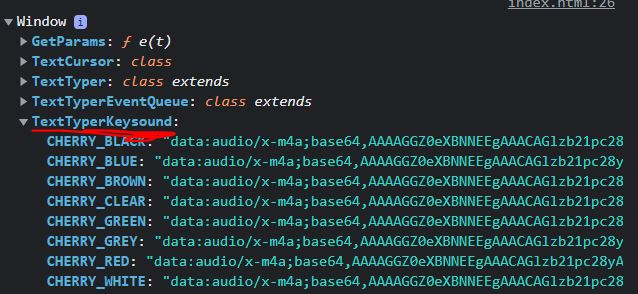

# ⌨️ Text Typer (Typescript ver) ⌨️

__Bundled JS ~10kB__

<br>


A Text typer simulation Javascript module for your webpage. Written in Typescript & bundled via webpack. Include in your web project immediately via `<script>` tags.

<br>


### Table of Contents

[Setting up](#setting-up)
[Getting started](#getting-started)
[The `TextTyper`](#the-texttyper-%E2%8C%A8%EF%B8%8F)
[The `TextTyperEventQueue`](#the-texttypereventqueue-%F0%9F%9A%B6%F0%9F%9A%B6)
[Extensions](#extensions-%F0%9F%94%8C)
1. [Keysound Extension](#1---keysound-extension-%F0%9F%94%8A)
1. [Styling Extension](#2---styling-extension-%F0%9F%8E%87) 

[Others](#others)

<br>

# Setting Up

To get started, simply put the script tag into your HTML document. Module will be loaded via CDN

```html
<>
```

Then, you may begin writing Javascript to use the text typer. See the next section to get a rough idea on how to do it:

<br>


# Getting Started

Here's an example on how you can use Text Typer:

```javascript
// Construct a TextTyper instance, passing in the HTML element you want it to type into
const tt = new TextTyper( document.querySelector('#myTextBox') );

// By obtaining the event queue, you can chain "events" which will be executed
// sequentially by the TextTyper after start() has been invoked!
tt.getEventQueue()
    .type('Hello World!')   // Type "Hello World!" character by character
    .standby(1000)  // Idle for 1 seconds
    .delete()       // Delete character by character until the end
    .standby(500)   // Idle for 0.5 seconds
    .type('Text Typer! ✏')
    .start();       
```

<br>

# The `TextTyper` ⌨️

When importing the module, a `TextTyper` class is exposed to the browser's `window` global object, which you can use to instantiate a `TextTyper` as seen earlier:

```js
const tt = new TextTyper( document.querySelector("#myTextBox"));
```

An instance of `TextTyper` contains numerous methods, most of which will perform the event immediately, asynchronously (non-blocking). Usually, you would want to use `EventQueue` which will be explained in the next section instead.

| Method | Parameters | Description | Example |
|-|-|-|-|
| `constructor` | `textBox` - Targeted HTML element to type text in.<br><br> `TextTyperConfig` (optional) - Same argument as in `configure()`. | Instantiates a `TextTyper` on the target HTML element to be the text box (The HTML element will be cleared of any child elements) | `const tt = new TextTyper(document.getElementById('my-box') );` |
| `type` | `text` - The text to be typed character by character | Types the string character by character into the text box. To open a new line, use `\n` | `tt.type('Hello \n World');` |
| `putText` | `text` - The text to be put into text box | Put the string __immediately__ into the text box. | `tt.putText('Hello World');` |
| `delete` | `count` (optional) - Number of characters to be deleted. <br><br> If it exceeds the number of existing characters in the textbox, it will simply stop after all characters are deleted. <br><br> If omitted, it will delete everything inside the text box, character by character | Deletes the specified number of characters from the text box. | `tt.delete();` <br> `tt.deletec(10);` |
| `clear` | - | Clears the textbox __immediately__ | `tt.clear();` |
| `configure` | `TextTyperConfig` An object containing 3 keys, all of which are optional: <br><br>1. `typeCPS` - Typing speed, in characters per second. <br>2. `deleteCPS` - Deletion speed, in characters per second. <br>3. `blinkDuration` - How fast the text cursor blinks (dissapear & reappear) | Change the configurations of the Text typer | `tt.configure({ typeCPS: 1000, deleteCPS: 1000, blinkDuration: 1000 });` |
| `getEventQueue` | - | Obtain the `EventQueue` | `const eq = tt.getEventQueue();` |

<br>

# The `TextTyperEventQueue` 🚶🚶

With `getEventQueue()` called, it will return a `TextTyperEventQueue` object which you can __chain__ events and have them execute one after another.

Most of the methods mentioned above in `TextTyper` are also chainable for `TextTyperEventQueue`.

Quick Example:
```js
const tt = new TextTyper( document.querySelector("#myTextBox"));
const eq = tt.getEventQueue();

eq
    .type("Hello World")
    .standby(1000)
    .delete(5)
    .type("Everyone")
    .standby(2000)
    .delete()
    .loop()
    .start();
```

| Method | Parameters | Description | Example |
|-|-|-|-|
| `start` | - | Starts the event queue, executing each event sequentially | `eq.type("Hello World!").start();` |
| `loop` | `count` (optional) - Number of times to loop. If no arguments specified, it will loop for infinite times. | Adds a loop event to the event queue. It will loop every previously added events for specified number of times. Note that after loop, the events are cleared. |  `eq.type("a").loop(3).start();` <br> `// This will cause 'aaaa' to be typed` |
| `standby` | `time` - Time in milliseconds for the idle duration | Idle for specified milliseconds before execution of next event in the queue | `eq.standby(3000)` |
| `clearHistory` | - | Clears the current history queue, so previously queued events won't be executed in the upcoming loop | `eq.type('a').clearHistory().loop().start()` <br> `// Only single 'a' will be typed` |
| `type` | `text` - The text to be typed character by character into text box <br> | Types the text provided into the text box | `eq.type('Hello World')` |
| `putText` | `text` - The text to be put into text box | Put the text __immediately__ into the text box. | `eq.putText('Hello World')` |
| `delete` | `count` (optional) - Number of characters to be deleted. <br><br>If exceeds the number of existing characters, it will simply stop after all characters are deleted. <br><br>If no argument given, it will delete everything inside the text box one by one | Deletes the specified number of characters from the text box. | `eq.delete();` <br> `eq.delete(10)` |
| `clearText` | - | Clears the textbox __immediately__ | `tt.clearText();` |
| `configure` | `TextTyperConfig` | Change the configuration of the Text typer | See [Previous Section's `configure()`](#the-texttyper) |

<br>

# Extensions 🔌

This package also comes with several extensions to enhance the functionality of the `TextTyper`. See below:

## 1 - Keysound Extension 🔊

__Bundled size ~46kB__

The __Keysound Extension__ features keyboard sounds when the `TextTyper` either types or delete a single character.

To include this extension, simply add the script tag below the core package:

```html
<>
```

With the extension included, you may see the browser's global `window` object is exposed to `TextTyperKeysound` object, consisting of several options of keysound to select:



The available options are: 

```js
TextTyperKeysound.CHERRY_BLACK
TextTyperKeysound.CHERRY_BLUE
TextTyperKeysound.CHERRY_BROWN
TextTyperKeysound.CHERRY_CLEAR
TextTyperKeysound.CHERRY_GREEN
TextTyperKeysound.CHERRY_GREY
TextTyperKeysound.CHERRY_RED
TextTyperKeysound.CHERRY_WHITE
```

To configure keysound is fairly easy. __In both `TextTyper` and `TextTyperEventQueue`, the `configureKeysound()` method is added__:

| Method | Parameters | Description | Example |
|-|-|-|-|
| `configureKeysound` | `TextTyperSoundConfig` object | Configures the key sound extension of TextTyper | `tt.configureKeysound({ typeSound: TextTyperKeysound.CHERRY_RED, deleteSound: TextTyperKeysound.CHERRY_BLACK, typeVolume: 1, deleteVolume: 0.5 });` |

where the `TextTyperSoundConfig` object is structered as follows:

```js
{
    typeSound?: KEYBOARD_SOUNDS,    //Eg: TextTyperKeysound.CHERRY_GREEN
    deleteSound?: KEYBOARD_SOUNDS,
    typeVolume?: number,
    deleteVolume?: number
}
```

__Example usage__: Start without key sound, but configured after typing `"Hello World"`, and `"Everyone"`.

```js
const tt = new TextTyper( document.querySelector("#myTextBox"));
const eq = tt.getEventQueue();

eq
    .type("Hello World")
    .configureKeysound({    
        typeSound: TextTyperKeysound.CHERRY_RED
    })
    .standby(1000)
    .delete(5)
    .type("Everyone")
    .configureKeysound({    
        deleteSound: TextTyperKeysound.CHERRY_BLUE
    })
    .standby(2000)
    .delete()
    .start();
```


## 2 - Styling extension 🎇

__Bundled size ~10kB__

The styling extension provides interfaces to change the cursor's appearance, as well as a method for you to directly modify the CSS for both the cursor and the textbox.

To get started, include the `<script>` tag:

```html
<>
```

Once included, `BLINK_MODE` and `CURSOR_STYLE` objects will be included in the browser's global `window` object. You will use these values in the styling extension configurations later.


```js
// BLINK_MODE
{
    NONE = 'BLINK_NONE',            // Does not blink at all
    CONSTANT = 'BLINK_CONSTANT',    // Default. Appear and dissapears
    LINEAR = 'BLINK_LINEAR'         // Fades in and out
}
// CURSOR_STYLE
{
    VERTICAL = 'STYLE_VERT',
    I = 'STYLE_I',
    Y = 'STYLE_Y',
    _ = 'STYLE__',
    BLOCK = 'STYLE_BLOCK',
    LEFTARR = 'STYLE_LEFTARR',
    NONE = 'STYLE_NONE'
}
```


These are the methods added to both the `TextTyper` and `TextTyperEventQueue` which you can use:

| Method | Parameters | Description | Example |
|-|-|-|-|
| `configureStyling` | `StylingOptions` object. See below | Apply preset styles to the `TextCursor` | `tt.configureStyling({ blinkMode: BLINK_MODE.LINEAR, cursorStyle: CURSOR_STYLE._ })` |
| `setCursorCss` | `{ cssProperty: value }` object - An object consisting of css properties as key and its value | Set the css properties on the cursor, which is a `<span>` element. | `tt.setCursorCss({ "background-color: "blue", "box-shadow": "0 0 5px #000" })` |
| `setTextboxCss` | `{ cssProperty: value }` object - An object consisting of css properties as key and its value | Set the css properties on the textbox, which is the HTML element passed into the constructor when you initialize the `TextTyper`. | `tt.setTextboxCss({ color: "orange", "text-align": "center" })` |

Where the `StylingOptions` object is structured as follows:

```js
{
    blinkMode?: BLINK_MODE; // Eg: BLINK_MODE.LINEAR
    cursorStyle?: CURSOR_STYLE; // Eg: CURSOR_STYLE.Y
}
```

__Example on how you might use it:__

```js
const tt = new TextTyper( document.querySelector("#myTextBox"));
const eq = tt.getEventQueue();

eq
    .type("Type Default")
    .standby(1000)
    .delete()
    .configureStyling({
        cursorStyle: CURSOR_STYLE.Y
        blinkMode: BLINK_MODE.LINEAR
    })
    .type("Type in Y")
    .standby(1000)
    .delete()
    .configureStyling({
        cursorStyle: CURSOR_STYLE._
    })
    .type("Type in _")
    .standby(1000)
    .delete()
    .start();
```


# Others

1. If you want a more customized styling, you can always resolve to writing the CSS yourself. The text cursor is just a `<span>` element. The HTML looks as follows:


Therefore, to style the textbox, you could use CSS selector `.text-box`. Likewise, you could style the cursor with the selector `[data-is='text-cursor']`.